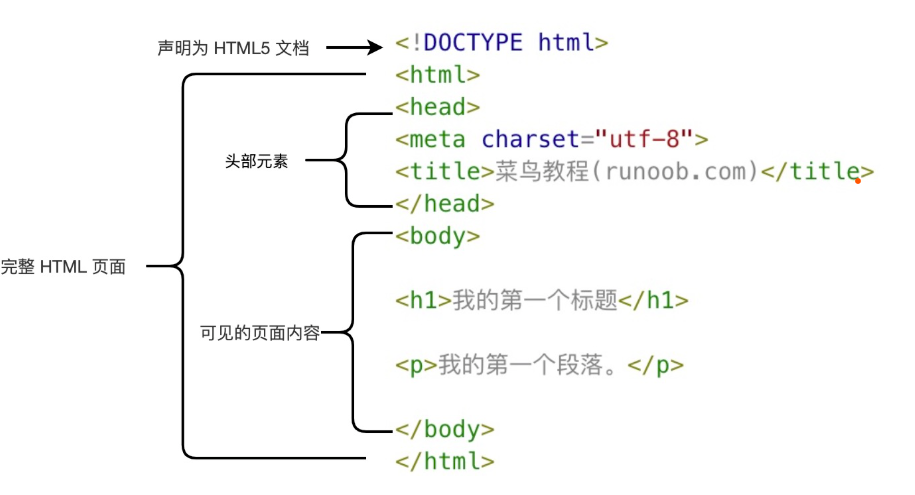

# HTML簡介~~小貓娘~~
  - HTML 指的是超文本編輯語言: HyperText Markup Language
  她不是編程語言，是標記語言，是一套markup tag
  - HTML文檔（也被叫做web頁面）包括HTML標簽和文本内容。
  ### 完整的HTML結構
  如圖所示：
  
# HTML標簽（元素）
  ##### <標簽>内容</標簽>
  ***HTML tag***
  這玩意是雙胞胎，*成對出現*。~~貓娘の耳朵~~
  - HTML標簽分為兩種（兩個耳朵）：
  - 閉合（結束）標簽（Single-tag）：只有一個標簽，如：&lt;br&gt;
  - 開放（開始）標簽（Start-tag）：開啟標簽，並且有內容，如：&lt;div&gt;
  開始標簽和自閉標簽的差別在於：
  - 自閉標簽不需要有內容，可以直接寫成&lt;br&gt;
  - 開始標簽需要有內容，需要另一個相同的標簽來結束，如：&lt;div&gt;內容&lt;/div&gt;
  開始標簽的內容可以是任何東西，如文字、圖片、表格、列表等。
  開始標簽的屬性（Attribute）可以設定標簽的屬性
  屬性的格式為：
  - 屬性名稱="屬性值" 
  屬性名稱和屬性值必須用雙引號包起來。
  屬性名稱和屬性值間以等號隔開。

# HTMLのAI編程助手
  ### FITTEN CODE
  這是一個AI編程助手，可以幫你快速生成HTML標簽。（？）
   #### Press tab to accept all completion suggestions.
   按下TAB鍵接受所有完成建議。
   #### Press CTRL+⬇️ (Windows, Linux) / CMD+⬇️ (macOS) to accept a line of completion suggestions.
   按下CTRL+⬇️ (Windows, Linux) / CMD+⬇️ (macOS) 接受一個單詞的補全建議。
   #### Press CTRL+➡️ (Windows, Linux) / CMD+➡️ (macOS) to accept a single word completion suggestion.
   按下CTRL+➡️ (Windows, Linux) / CMD+➡️ (macOS) 接受一個單字的補全建議”
  具體使用方法請見FITTEN CODE網站。
  點擊下方網址進入。
  https://fitten.io/
  或者這個網站：
  https://www.runoob.com/html/fitten-code-html.html
  （菜鳥教程是真的好用）

# HTML標題
  ###### &lt;h1&gt;標題1&lt;/h1&gt;
  ###### &lt;h2&gt;標題2&lt;/h2&gt;
  ###### &lt;h3&gt;標題3&lt;/h3&gt;
  ###### &lt;h4&gt;標題4&lt;/h4&gt;
  ###### &lt;h5&gt;標題5&lt;/h5&gt;
  ###### &lt;h6&gt;標題6&lt;/h6&gt;
  ###### 這些是HTML標題（Heading）的六種等級，從h1到h6。
  注意：h1到h6的標題，在網頁上通常會有不同的顏色，h1的顏色通常是藍色，h2的顏色通常是綠色。
  （你可以用CSS更改標題的顏色。）
  :<

# HTML段落 
  ###### &lt;p&gt;段落&lt;/p&gt;
  ###### 這是HTML段落的標記。
  （你可以在段落中加入:
  ###### &lt;a&gt;超鏈接&lt;/a&gt;，
  ###### &lt;img&gt;圖片&lt;/img&gt;，
  ###### &lt;strong&gt;粗體&lt;/strong&gt;，
  ###### &lt;em&gt;斜體&lt;/em&gt;，
  ###### &lt;ul&gt;項目列表&lt;/ul&gt;，
  ###### &lt;ol&gt;順序列表&lt;/ol&gt;，
  ###### &lt;li&gt;項目&lt;/li&gt;，
  ###### &lt;table&gt;表格&lt;/table&gt;，
  ###### &lt;tr&gt;表格行&lt;/tr&gt;，
  ###### &lt;td&gt;表格資料&lt;/td&gt;等元素。）

# HTML鏈接
