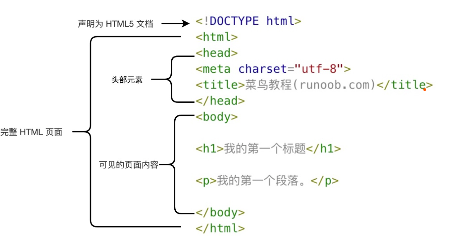

# HTML簡介~~小貓娘~~
  - HTML 指的是超文本編輯語言: HyperText Markup Language
  她不是編程語言，是標記語言，是一套markup tag
  - HTML文檔（也被叫做web頁面）包括HTML標簽和文本内容。
  ### 完整的HTML結構
  如圖所示：
  
---

title: H5
published: 2025-01-06
description: 'HTML5 娘是 Web 的未來：一篇小貓娘風格的 HTML5 入門介紹。'
image: './h.jpg'
tags: [HTML5, HTML, Web, 前端]
category: 'HTML小貓娘'
draft: false
lang: 'zh-TW'
-------------

# HTML5 簡介：小貓娘帶你認識 Web 的骨架

喵，歡迎來到 HTML5 小教室。

今天登場的是一位負責搭建網頁骨架的前端小貓娘：**HTML5 娘**。

她不是程式語言少女，而是標記語言貓娘。她不負責計算邏輯，也不負責資料庫魔法，她的工作是把網頁內容整理成瀏覽器看得懂的結構。

> HTML = HyperText Markup Language
> 中文常譯為：超文字標記語言。

簡單來說：

* HTML 是網頁的骨架
* CSS 是網頁的衣服和妝容
* JavaScript 是讓網頁動起來的魔法

HTML5 娘負責說：「這裡是標題、這裡是段落、這裡是圖片、這裡是按鈕喵！」

---

## HTML5 娘的人設

| 屬性  | 設定                 |
| --- | ------------------ |
| 名字  | HTML5 娘            |
| 種族  | Web 小貓娘            |
| 職業  | 網頁骨架設計師            |
| 武器  | 標籤 tag             |
| 口頭禪 | 「結構清楚，頁面才可愛喵！」     |
| 夥伴  | CSS 娘、JavaScript 娘 |
| 擅長  | 排版語義、內容結構、媒體嵌入、表單  |

HTML5 娘最在意的不是華麗，而是**語義清楚**。

她會把標題、段落、圖片、連結、表單、區塊都安排到正確位置，讓瀏覽器、搜尋引擎和使用者都能理解頁面內容。

---

## HTML 是什麼？

HTML 指的是 HyperText Markup Language。

它是一種標記語言，不是一般意義上的程式語言。

HTML 使用一組組標籤來描述網頁內容，例如：

```html
<h1>這是一個標題</h1>
<p>這是一段文字。</p>
<a href="https://example.com">這是一個連結</a>
```

瀏覽器讀到這些標籤後，就知道：

* `<h1>` 是最重要的標題
* `<p>` 是段落
* `<a>` 是連結
* `` 是圖片
* `<ul>` 和 `<li>` 是列表

---

## 完整的 HTML 結構

一份基本 HTML5 文件通常長這樣：

```html
<!doctype html>
<html lang="zh-TW">
  <head>
    <meta charset="utf-8">
    <meta name="viewport" content="width=device-width, initial-scale=1">
    <title>我的第一個 HTML5 頁面</title>
  </head>
  <body>
    <h1>Hello, HTML5 娘！</h1>
    <p>這是一個由 HTML5 建立的網頁。</p>
  </body>
</html>
```

原本的結構圖也可以保留在這裡：


---

## 每個部分在做什麼？

### `<!doctype html>`

這一行告訴瀏覽器：這是一份 HTML5 文件。

```html
<!doctype html>
```

它就像 HTML5 娘打開教室門時說：

> 今天用現代標準上課喵。

---

### `<html>`

`<html>` 是整個頁面的根元素。

```html
<html lang="zh-TW">
</html>
```

`lang="zh-TW"` 表示主要語言是繁體中文，有助於搜尋引擎、翻譯工具和輔助閱讀器理解內容。

---

### `<head>`

`<head>` 放的是頁面的資訊，不是主要可見內容。

常見內容包括：

```html
<meta charset="utf-8">
<meta name="viewport" content="width=device-width, initial-scale=1">
<title>頁面標題</title>
```

常見用途：

* 設定文字編碼
* 設定手機版畫面
* 設定頁面標題
* 引入 CSS
* 加入 SEO 描述
* 加入網站 icon

---

### `<body>`

`<body>` 放的是使用者真正看得到的內容。

```html
<body>
  <h1>標題</h1>
  <p>段落</p>
</body>
```

簡單說：

* `<head>` 是後台設定
* `<body>` 是舞台畫面

---

## HTML 標籤：小貓娘的耳朵

HTML 標籤通常成對出現，就像小貓娘的兩隻耳朵：

```html
<p>這是一段文字</p>
```

其中：

* `<p>` 是開始標籤
* `</p>` 是結束標籤
* 中間是內容

也有一些元素不需要成對，例如：

```html
<br>

<input type="text">
```

這類元素通常用來換行、插入圖片或建立表單輸入。

---

## HTML 屬性 Attribute

屬性用來補充標籤的設定。

例如：

```html
<a href="https://example.com" target="_blank">打開新頁面</a>
```

這裡：

* `href` 是連結位置
* `target="_blank"` 表示用新分頁打開

屬性的基本格式是：

```html
屬性名稱="屬性值"
```

HTML5 娘提醒你：

> 屬性要放在開始標籤裡，值最好用引號包起來喵。

---

## HTML 標題 Heading

HTML 有六個層級的標題：

```html
<h1>標題 1</h1>
<h2>標題 2</h2>
<h3>標題 3</h3>
<h4>標題 4</h4>
<h5>標題 5</h5>
<h6>標題 6</h6>
```

一般來說，一個頁面建議只有一個主要 `<h1>`。

它就像文章的主標題，也是 HTML5 娘最重視的門牌。

---

## HTML 段落 Paragraph

段落使用 `<p>`：

```html
<p>這是一段文字。</p>
```

段落適合放正文內容。

不要用很多 `<br>` 來硬切版面。真正的排版應該交給 CSS。

---

## HTML 連結 Link

連結使用 `<a>`：

```html
<a href="https://example.com">前往 example</a>
```

`href` 是連結目標。

`<a>` 就像 HTML5 娘幫你打開傳送門，點一下就能跳到另一個地方。

如果想在新分頁打開：

```html
<a href="https://example.com" target="_blank" rel="noopener noreferrer">
  開啟新分頁
</a>
```

---

## HTML 圖片 Image

圖片使用 ``：

```html

```

其中：

* `src` 是圖片路徑
* `alt` 是圖片無法顯示時的替代文字

`alt` 很重要，因為它可以幫助：

* 圖片載入失敗時顯示說明
* 螢幕閱讀器理解圖片
* 搜尋引擎理解圖片內容

---

## HTML 列表 List

### 無序列表

```html
<ul>
  <li>HTML</li>
  <li>CSS</li>
  <li>JavaScript</li>
</ul>
```

適合用於沒有固定順序的項目。

### 有序列表

```html
<ol>
  <li>建立 HTML</li>
  <li>加入 CSS</li>
  <li>加入 JavaScript</li>
</ol>
```

適合用於步驟、排名、流程。

---

## 強調文字

```html
<strong>重要內容</strong>
<em>需要強調的語氣</em>
```

* `<strong>` 表示重要
* `<em>` 表示語氣上的強調

不要只把它們當成粗體和斜體。它們本身帶有語義。

---

## HTML5 的語義化標籤

HTML5 娘最驕傲的地方，就是她不只是能放內容，還能讓內容更有語義。

常見語義化標籤：

| 標籤          | 用途      |
| ----------- | ------- |
| `<header>`  | 頁首或區塊標題 |
| `<nav>`     | 導覽列     |
| `<main>`    | 頁面主要內容  |
| `<article>` | 一篇獨立文章  |
| `<section>` | 一個主題區塊  |
| `<aside>`   | 側邊資訊    |
| `<footer>`  | 頁尾      |

範例：

```html
<header>
  <h1>HTML5 娘的教室</h1>
</header>

<nav>
  <a href="/">首頁</a>
  <a href="/posts/">文章</a>
</nav>

<main>
  <article>
    <h2>HTML5 是什麼？</h2>
    <p>HTML5 是現代 Web 的核心標準之一。</p>
  </article>
</main>

<footer>
  <p>Made with HTML5.</p>
</footer>
```

---

## HTML 表格 Table

表格適合呈現規則資料。

```html
<table>
  <thead>
    <tr>
      <th>標籤</th>
      <th>用途</th>
    </tr>
  </thead>
  <tbody>
    <tr>
      <td>&lt;p&gt;</td>
      <td>段落</td>
    </tr>
    <tr>
      <td>&lt;a&gt;</td>
      <td>連結</td>
    </tr>
  </tbody>
</table>
```

注意：不要用表格做整個網站排版。現代網頁排版通常使用 CSS Flexbox 或 Grid。

---

## HTML 表單 Form

表單讓使用者輸入資料，例如登入、搜尋、留言。

```html
<form>
  <label for="name">名字</label>
  <input id="name" name="name" type="text">

  <label for="message">留言</label>
  <textarea id="message" name="message"></textarea>

  <button type="submit">送出</button>
</form>
```

注意：

* `label` 的 `for` 要對應輸入框的 `id`
* `input` 要有合適的 `type`
* 表單按鈕可以用 `<button>`

這樣可用性和無障礙體驗會更好。

---

## HTML5 多媒體

HTML5 支援原生影片與音訊。

### 影片

```html
<video controls width="640">
  <source src="demo.mp4" type="video/mp4">
  你的瀏覽器不支援 video 標籤。
</video>
```

### 音訊

```html
<audio controls>
  <source src="demo.mp3" type="audio/mpeg">
  你的瀏覽器不支援 audio 標籤。
</audio>
```

`controls` 會顯示播放控制器，例如播放、暫停、音量等。

---

## HTML、CSS、JavaScript 的關係

| 角色         | 負責內容 | 小貓娘比喻    |
| ---------- | ---- | -------- |
| HTML       | 結構   | 骨架與房間配置  |
| CSS        | 樣式   | 衣服、髮型、顏色 |
| JavaScript | 行為   | 魔法、互動、動作 |

範例：

```html
<h1 class="title">Hello HTML5</h1>
<button id="btn">點我</button>
```

CSS 讓它變漂亮：

```css
.title {
  color: hotpink;
}
```

JavaScript 讓它能互動：

```js
document.querySelector('#btn').addEventListener('click', () => {
  alert('喵！HTML5 娘向你打招呼！');
});
```

---

## HTML5 小貓娘的學習路線

1. 先學基本標籤：`h1`、`p`、`a`、`img`、`ul`、`li`
2. 再學文件結構：`html`、`head`、`body`
3. 學語義化標籤：`header`、`main`、`article`、`section`
4. 學表單：`form`、`input`、`label`、`button`
5. 學 CSS 讓頁面變漂亮
6. 學 JavaScript 讓頁面動起來

---

## 常見錯誤

### 1. 忘記結束標籤

錯誤：

```html
<p>這是一段文字
```

建議：

```html
<p>這是一段文字</p>
```

---

### 2. 圖片沒有 `alt`

不建議：

```html

```

建議：

```html

```

---

### 3. 標題層級亂跳

不建議：

```html
<h1>主標題</h1>
<h4>突然變很小的副標題</h4>
```

建議：

```html
<h1>主標題</h1>
<h2>副標題</h2>
<h3>更細的段落標題</h3>
```

---

## HTML の AI 編程助手：FITTEN CODE

FITTEN CODE 是一個 AI 編程助手，可以幫你快速生成 HTML 標籤、補全程式碼和提供寫法提示。

常見快捷方式：

* Press `Tab` to accept all completion suggestions.
* Press `Ctrl + Down` on Windows / Linux，或 `Cmd + Down` on macOS，接受一整行補全建議。
* Press `Ctrl + Right` on Windows / Linux，或 `Cmd + Right` on macOS，接受單字補全建議。

參考：

* https://fitten.io/
* https://www.runoob.com/html/fitten-code-html.html

---

## 一個完整 H5 小頁面範例

下面是一個簡單的 HTML5 小貓娘介紹頁：

```html
<!doctype html>
<html lang="zh-TW">
  <head>
    <meta charset="utf-8">
    <meta name="viewport" content="width=device-width, initial-scale=1">
    <title>HTML5 小貓娘</title>
    <style>
      body {
        font-family: system-ui, sans-serif;
        margin: 0;
        background: #fff7fb;
        color: #2d1b2e;
      }

      main {
        max-width: 760px;
        margin: auto;
        padding: 48px 20px;
      }

      .card {
        padding: 28px;
        border-radius: 24px;
        background: white;
        box-shadow: 0 20px 60px rgba(255, 105, 180, 0.18);
      }

      .tag {
        display: inline-block;
        padding: 4px 10px;
        border-radius: 999px;
        background: #ffe1f0;
        color: #c026d3;
        font-weight: 700;
      }

      button {
        border: 0;
        border-radius: 999px;
        padding: 12px 18px;
        background: #ec4899;
        color: white;
        font-weight: 700;
        cursor: pointer;
      }
    </style>
  </head>
  <body>
    <main>
      <article class="card">
        <span class="tag">HTML5 Catgirl</span>
        <h1>你好，我是 HTML5 娘喵！</h1>
        <p>我負責整理網頁的骨架，讓內容變得清楚又可讀。</p>
        <button onclick="alert('喵！開始學 HTML5 吧！')">
          開始學習
        </button>
      </article>
    </main>
  </body>
</html>
```

---

## 結語

HTML5 娘不是負責炫技的角色，而是 Web 世界裡最重要的基礎建築師。

她會幫你把內容放進正確的位置，讓瀏覽器、搜尋引擎、螢幕閱讀器和使用者都能理解這個頁面。

記住她的核心信念：

> 結構清楚，頁面才可愛喵。
