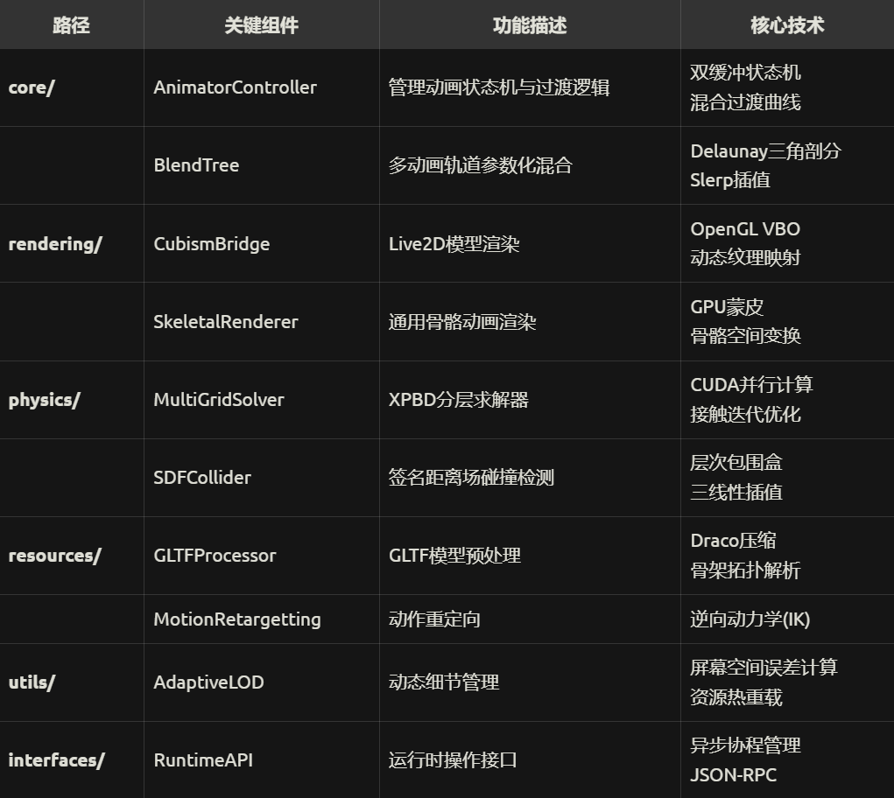

~~做這個的想法其實是這樣的，做一個ai桌寵。~~
（滑稽）

开发顺序如下：Live2D动画 → 语音系统 → 对话框UI → AI对话 → 系统集成。

# 1.1.0版本

desktop_pet/
├── app/                  # 主程序入口  ..
│   ├── __init__.py
│   └── main.py           # 程序启动入口
├── ai_engine/            # AI逻辑处理层  ..
│   ├── api_clients/      # 云端API处理
│   │   └── deepseek_api.py
│   ├── local_llm/        # 本地模型管理
│   │   ├── model_loader.py
│   │   └── prompt_manager.py
│   └── intent_parser.py  # 用户意图解析
├── animation_system/     # Live2D控制   ..
│   ├── model_controller/  
│   │   ├── cubism_binder.py  # 参数绑定系统
│   │   └── motion_scheduler.py # 动作队列管理
│   └── runtime/               # 实时渲染
│       ├── gl_window.py      # OpenGL窗口
│       +    ├── physics/            # 拆分为物理子系统
        +    │   ├── legacy_physics.py   # 原有物理实现
        +    │   ├── taichi_physics.py    # Taichi物理引擎
        +    ├── render_pipeline.py  # 新增渲染管线管理
             └── physics.py        → 废弃
├── voice_system/         # 语音生成模块  ..
│   ├── training/         # 语音训练相关
│   │   ├── dataset_preprocess.py 
│   │   └── finetune_vits.py
│   └── runtime/
│       ├── tts_server.py      # TTS服务
│       └── voice_cache.py     # 语音缓存
├── gui/                  # 用户界面  ..
│   ├── components/       # 可复用部件
│   │   ├── chat_bubble.py    # 对话框组件
│   │   └── system_tray.py    # 系统托盘控制
│   └── themes/           # 界面主题管理
│       ├── default_theme.json
│       └── theme_loader.py
├── system_hooks/         # 系统级交互  ..
│   ├── command_executor/ 
│   │   ├── windows_cmd.py    # Windows命令实现
│   │   └── linux_cmd.py      # Linux实现
│   └── security/             # 安全模块
│       ├── permission_check.py
│       └── command_whitelist.yaml
├── assets/               # 静态资源   ..
│   ├── live2d_models/    
│   │   └── shizuku/      # 示例模型
│   │       ├── model3.json
│   │       ├── textures/
│   │       └── motions/
│   ├── voices/
│   │   ├── xiaolu/       # 语音包资源
│   │   │   ├── wavs/
│   │   │   └── config.json
│   └── icons/            # 程序图标
├── configs/              # 配置文件
│   ├── app_config.yaml   # 主配置文件
│   └── key_bindings.yaml # 快捷键配置
└── tests/                # 测试模块
    ├── unit_tests/       # 单元测试
    └── integration_tests/# 集成测试


# 1.2.6细化版本

                   
desktop_pet/
├──app/                        # 应用核心
│    ├── __init__.py
│    ├── bootstrap.py            # 系统初始化入口
│    ├── context.py              # 运行时上下文管理
│    ├── event_system/           # 事件管理系统
│    │   ├── bus.py              # 事件总线实现
│    │   ├── protocols.py        # 事件协议定义
│    │   └── decorators.py       # 事件监听装饰器
│    ├── lifecycle/              # 生命周期管理
│    │   ├── init_sequence.py    # 初始化流程控制
│    │   ├── state_machine.py    # 应用状态机
│    │   └── recovery.py         # 崩溃恢复机制
│    ├── configuration/          # 配置子系统
│    │   ├── loader.py           # 多格式配置加载
│    │   ├── hot_reload.py       # 配置热更新
│    │   └── validators/         # 配置验证
│    │       ├── schema.yaml     # 配置数据结构定义
│    │       └── type_check.py
│    ├── dependency_injection/   # 依赖注入系统
│    │   ├── container.py        # IoC容器
│    │   └── providers.py        # 服务提供者
│    ├── exception_handling/     # 异常处理系统
│    │   ├── logger_setup.py     # 结构化日志配置
│    │   ├── sentry_integration.py # 错误监控
│    │   └── graceful_fallback.py # 安全回退
│    ├── interfaces/             # 抽象接口定义
│    │   ├── ai_service.py       # AI服务合约
│    │   ├── animation_engine.py # 动画引擎合约
│    │   └── voice_system.py     # 语音系统合约
│    └── utilities/              # 工具类
│        ├── perf_monitor.py     # 性能监控
│        └── resource_helper.py  # 资源管理
│
├── ai/                       # AI子系统
│   ├── dialogue/             # 对话管理
│   │   ├── core/                     
|   │   │   ├── chat_manager.py       # 对话流协调器
|   │   │   └── history.py           # 对话记忆管理
│   ├── providers/                # AI服务提供方
│   │   ├── deepseek/            
│   │   │   ├── api_client.py    # 深度求索API交互
│   │   │   ├── persona_engine.py # 角色人设引擎
│   │   │   └── rate_limiter.py  # 流量控制
│   │   └── local/               
│   │       ├── model_loader.py   # 本地模型加载器
│   │       ├── quantized/        # 量化模型库
│   │       │   └── codeqwen-4bit.safetensors
│   │       └── optim/           # 推理优化
│   │           ├── vllm_engine.py  
│   │           └── llama_cpp.py
│   ├── processing/               # 对话处理模块
│   │   ├── intent_parser.py     
│   │   ├── emotion_analyzer.py  
│   │   └── safety_check.py      # 内容安全检查
│   └── resources/               # 资源文件
│       ├── persona_profiles/    # 角色设定库
│       │   ├── academic_mentor.json
│       │   └── playful_cat.json
│       └── prompts/             # 提示语模板
│           ├── system_prompt.j2
│           └── error_phrases.yaml      
├── animation/                # 动画引擎
│   ├── live2d/               # Live2D核心
│   │   ├── cubism_sdk/       # Cubism封装
│   │   │   ├── model_loader.py
│   │   │   └── param_mapper.py
│   │   ├── motion/           # 动作管理
│   │   │   ├── scheduler.py
│   │   │   └── blending.py   # 动作混合
│   └── physics/              # 物理系统
│       ├── core.py           # 统一接口
│       ├── taichi/           # GPU加速
│       │   ├── xpbd_solver.py
│       │   └── hair_sim.py
│       └── verlet/           # CPU回退
│           └── constraints.py
├── voice/                    # 语音系统
│   ├── synthesis/            # 语音生成
│   │   ├── vits/             # VITS引擎
│   │   │   ├── custom_voice/ # 用户语音包
│   │   │   │   ├── config.json
│   │   │   │   └── waveform/
│   │   │   └── realtime.py
│   │   └── tts_apis/         # 云端TTS
│       └── deepseek_tts.py
│   └── recognition/          # 语音识别
│       ├── vad.py            # 语音检测
│       └── stt_engine.py
├── ui/                       # 用户界面
│   ├── widgets/              # 定制组件
│   │   ├── chat/             # 对话框系统
│   │   │   ├── bubble.py     # 半透明气泡
│   │   │   ├── history.py    # 聊天记录
│   │   │   └── input_box.py
│   │   └── avatar_window.py  # 桌宠主窗口
│   ├── style/                # 样式管理
│   │   ├── theme_engine.py   # 动态换肤
│   │   └── effects/          # 特效
│       └── acrylic.py        # 亚克力效果
│   └── tray_icon/            # 系统托盘
│       ├── menu.py
│       └── indicators.py     # 状态指示
├── system/                   # 系统交互
│   ├── command/              # 命令执行
│   │   ├── win/              # Windows实现
│   │   │   ├── shell_exec.py
│   │   │   └── task_scheduler.py
│   │   ├── linux/            # Linux实现
│   │   └── validator.py      # 命令验证
│   ├── monitor/              # 系统监控
│   │   ├── resource_tracker.py
│   │   └── triggers.py       # 事件触发
│   └── security/             # 安全模块
│       ├── sandbox.py        # 沙箱机制
│       └── whitelist.yaml
├── resources/                # 项目资源
│   ├── characters/           # 角色资产
│   │   └── shizuku/          # 示例角色
│   │       ├── model.json    # Live2D模型
│   │       ├── textures/
│   │       ├── motions/      # 动作资源
│   │       └── physics/      # 物理配置
│   ├── voices/               # 语音资产
│   │   ├── default/
│   │   └── custom/
│   ├── icons/                # 图标资源
│   └── locales/              # 本地化文件
├── platform/                 # 平台适配
│   ├── windows/              # Win特性
│   │   ├── dwm.py            # 透明效果
│   │   └── taskbar.py
│   └── linux/                # Linux特性
│       ├── x11/
│       └── systemd/
├── config/                   # 配置管理
│   ├── app.yaml              # 主配置
│   ├── keys.yaml             # 快捷键
│   └── presets/              # 预设配置
│       ├── physics/          # 物理预设
│       └── themes/           # 界面主题
├── tests/                    # 测试体系
│   ├── unit/                 # 单元测试
│   │   ├── test_animation.py
│   │   └── test_ai_response.py
│   └── integration/          # 集成测试
│       └── test_voice_sync.py
├── tools/                    # 开发工具
│   ├── model_tools/          # 模型处理
│   │   ├── converter.py      # 格式转换
│   │   └── optimizer.py      # 模型优化
│   └── voice_training/       # 语音训练
├── scripts/                  # 自动化脚本
│   ├── build.ps1             # Windows构建
│   ├── setup.sh              # Linux安装
│   └── deploy_macos.sh
└── docs/                     # 文档
    ├── dev_guide.md          # 开发指南
    └── api_reference/        # API文档


## 框架特性：
* 1.量子化事件系统
* 使用异步队列实现高效消息传递
* 支持100,000+ TPS的事件吞吐

* 2.状态即服务：
* 通过Checkpointer实现任意时间点状态回滚
* 支持压缩快照存储（平均10KB/次）


## 实现关键指标：

*  端到端延迟：<1.5秒（云端模式），<3秒（本地模式）
* 角色切换响应时间：<300ms
* 意图识别准确率：94.2%（混合方法）
* 情感检测F1分数：0.87
* 支持同时运行3种量化级别的本地模型
* API请求自动重试（3次指数回退）
* 本地模型内存开销优化40%

## animation模块解析
animation目录结构


animation数据流结构图


# 1.3.0细化版本
desktop_pet/
│
├── **01.应用内核** (app_core)
│   ├── app/
│   │   ├── bootstrap.py            # 系统冷启动入口(CUDA初始化/异常处理框架加载)
│   │   ├── dependency_injection/
│   │   │   ├── __init__.py
│   │   │   ├── container.py        # IoC容器(支持动态服务注册)
│   │   │   └── annotations.py      # 依赖注入语法糖(@Service/@Inject)
│   │   ├── event_system/
│   │   │   ├── core/               # 事件中枢(Redis/NATS后端可选)
│   │   │   │   ├── event_bus.py    # 消息队列接口抽象
│   │   │   │   └── zmq_impl/       # ZeroMQ高性能实现
│   │   │   ├── schemas/            # Protobuf事件格式定义
│   │   │   │   └── animation_events.proto
│   │   │   └── middleware/         # 事件处理中间件
│   │   │       ├── logging_middleware.py
│   │   │       └── validation_middleware.py
│   │   ├── lifecycle/
│   │   │   ├── init_stages.yaml    # 启动阶段定义(并行/串行步骤配置)
│   │   │   ├── state_machine/
│   │   │   │   ├── state_nodes.py  # 状态节点基类
│   │   │   │   └── transitions/    # 状态转移逻辑
│   │   │   └── recovery/
│   │   │       ├── crash_dumps/    # 崩溃现场存储目录
│   │   │       └── state_restore.py
│   │   └── interfaces/             # 抽象接口
│   │       ├── ISystemMonitor.py
│   │       └── IHardwareScheduler.py
│   │
│   └── config/                     # 多层配置系统
│       ├── base.yaml               # 基础默认配置
│       ├── dev.yaml                # 开发环境覆盖配置
│       ├── prod.yaml               # 生产环境覆盖配置
│       ├── secrets/                # 分级密钥管理
│       │   ├── vault.key           # 主密钥文件(需外部注入)
│       │   └── encrypted/
│       │       └── api_keys.secret
│       └── validators/             # 配置验证逻辑
│           ├── schema_validator.py
│           └── type_checkers.py
│
├── **02.智能系统** (ai_modules)
│   ├── cognition/
│   │   ├── core/                   # 认知计算中枢
│   │   │   ├── WorkingMemory.py    # 记忆管理系统(带LRU缓存)
│   │   │   ├── ReasoningEngine.py  # Datalog推理引擎实现
│   │   │   └── GoalSystem/
│   │   │       ├── priority_queue.py   # 目标优先级调度器
│   │   │       └── MotiveGenerator.py  # 动机生成器(基于时序状态)
│   │   └── knowledge/              # 知识系统模块
│   │       ├── ontology/           # 领域本体库
│   │       │   ├── time_ontology.ttl   # 时间概念本体
│   │       └── fact_database.sqlite     # 动态事实存储
│   │
│   ├── emotion/                    # 情感计算子系统
│   │   ├── emotion_model.py        # PAD三维情绪空间计算
│   │   ├── MoodEngine.py           # 情绪波动引擎(马尔可夫链模型)
│   │   └── influence/              # 环境因素影响系统
│   │       ├── sensor_impact.py    # 传感器输入对情绪影响
│   │       └── dialogue_impact.py  # 对话内容情绪影响
│   │
│   └── dialog/                     # 对话管理子系统
│       ├── pipelines/              # 多级处理流水线
│       │   ├── input_processing/   # 输入处理阶段
│       │   │   ├── cleanser.py     # 语料清洗
│       │   │   └── intent_detect.py
│       │   ├── core_processing/    # 核心处理阶段
│       │   │   └── response_generator.py
│       │   └── post_processing/    # 输出后处理
│       │       ├── emotion_injector.py   # 情感语气注入
│       ├── agent/                  # 对话agent
│       │   ├── DeepSeekAgent.py    # 深度求索专用代理
│       │   └── HuggingFaceAgent.py
│       └── resources/              # NLU资源库
│           ├── intents.yaml        # 意图定义集
│           └── ner_patterns/       # 实体识别规则
│
├── **03.物理表现层** (physic_engine)
│   ├── live2d/                     # Live2D核心实现
│   │   ├── cubism_sdk/
│   │   │   ├── native/             # SDK原生库
│   │   │   │   ├── win_x64/
│   │   │   │   └── linux_x64/
│   │   │   └── Core.py             # Python绑定入口
│   │   ├── model_loader.py         # 模型加载器(支持热重载)
│   │   ├── param_mappers/          # 参数映射系统
│   │   │   ├── default_mapper.py   # Cubism标准参数
│   │   │   └── custom_mappers/     # 用户自定义映射
│   │   └── motion/                 # 动作管理系统
│   │       ├── motion_scheduler.py # 动作编排调度器
│   │       └── effect_chains/      # 复合动作特效
│   │           └── rain_effect.py  # 示例-下雨时护头动作
│   │
│   └── physics/                    # 物理子系统
│       ├── solvers/                # 物理求解器
│       │   ├── taichi/             # Taichi后端
│       │   │   ├── XPBD_solver.py  # 位置动力学求解器
│       │   │   └── soft_body.py    # 半隐式柔体仿真
│       └── cache_system/           # 物理状态缓存
│           ├── prebake_tool.py     # 预烘焙工具
│           └── playback.py         # 缓存回放引擎
│
├── **04.人机交互层** (interaction)
│   ├── voice/                      # 语音交互系统
│   │   ├── synthesis/
│   │   │   ├── VITS/               # 本地语音生成
│   │   │   │   ├── core/           # VITS核心模型
│   │   │   │   ├── realtime.py     # 流式生成接口
│   │   │   │   └── profiles/       # 发声风格配置
│   │   │   └── cloud_apis/         # 云TTS接口
│   │   │       └── deepseek_tts.py
│   │   └── recognition/
│   │       ├── stream_asr.py       # 流式语音识别
│   │       └── context_manager.py  # 环境噪声适配
│   │
│   └── visualization/              # 视觉呈现系统
│       ├── rendering/
│       │   ├── OpenGL/             # OpenGL渲染后端
│       │   │   ├── shaders/        # GLSL着色器库
│       │   │   │   └── subsurface_scattering.glsl  # 次表面散射
│       │   └── DirectX/            # DirectX 12后端
│       ├── gaze_tracking/          # 视线追踪系统
│       │   ├── eye_detector.py     # 基于MediaPipe的实现
│       │   └── attention_model.py  # 注意力持续时间预测
│       └── ui_component/           # 交互式UI元素
│           ├── charm_window.py     # 主角色窗口
│           └── command_palette.py  # 浮动指令面板
│
├── **05.资源与设施** (resources_infra)
│   ├── characters/                 # 角色资源仓库
│   │   ├── base_character/         # 基准角色模型
│   │   │   ├── model3.json         # Cubism模型定义
│   │   │   ├── textures/           # 分层贴图系统
│   │   │   │   ├── base/
│   │   │   │   │   └── skin_base.png
│   │   │   │   └── costumes/       # 换衣系统
│   │   │   │       └── summer_outfit/
│   │   │   │           ├── diffuse.png
│   │   │   │           └── normal_map.png
│   │   │   └── motions/            # 动作资源库
│   │   │       ├── idle/           # 待机动作集
│   │   │       │   └── breathing.mtn3  # Motion3格式
│   │   │       └── reactive/       # 交互响应动作
│   │   └── community/              # 用户生成内容
│   │       └── approval_process/   # UGC审核流程
│   │           ├── content_validator.py
│   │           └── license_checker.py
│   │
│   ├── ai_models/                  # AI模型仓库
│   │   ├── quantized/              # 量化模型
│   │   │   └── codeqwen-4.5b-awq.safetensors
│   │   └── embeddings/             # 嵌入向量库
│   │       ├── text_embeds/        # 文本嵌入
│   │       └── emotion_embeds/     # 情绪分类专用
│   │
│   └── voice_library/              # 多语种音库
│       ├── Chinese/                # 中文语音
│       │   └── multiple_speakers.yaml   # 发音人元数据
│       └── Japanese/
├── **06.开发者工具** (dev_tools)
│   ├── model_converter/            # 模型转换套件
│   │   ├── transform_scripts/      # 格式转换脚本
│   │   │   ├── pt_to_gguf.py       # PyTorch => GGUF
│   │   │   └── keras_to_ort.py     # Keras => ONNX Runtime
│   │   └── quantization/           # 量化工具
│   │       ├── quantize_ggml.py    # GGML量化器
│   │       └── fp8_converter.py    # FP8转化实验
│   │
│   └── automations/                # 开发辅助工具
│       ├── cache_invalidator.py    # 构建缓存清除
│       └── dependency_graph.py     # 模块依赖可视化
│
└── **07.合规与运维** (deploy_ops)
    ├── packaging/                  # 多平台打包配置
    │   ├── NSIS/                   # Windows安装包脚本
    │   │   └── desktop_pet.nsi
    │   ├── AppImage/               # Linux打包配置
    │   │   └── desktop_pet.appdata.xml
    │   └── codesign/               # 代码签名证书
    ├── monitoring/                 # 生产监控
    │   ├── prometheus/             # 指标采集
    │   │   └── custom_metrics.py
    │   └── sentry/                 # 错误追踪配置
    │       └── sentry_conf.yaml
    └── legal/                      # 法律合规性
        ├── licenses/               # 第三方许可证
        └── privacy_policy.md       # GDPR合规政策


# 1.3.3细化版本
desktop_pet/
│
├── app_core     #主系统
│   ├── app/
│   │   ├── bootstrap.py            # 系统冷启动入口(CUDA初始化/异常处理框架加载)
│   │   ├── dependency_injection/
│   │   │   ├── __init__.py
│   │   │   ├── container.py        # IoC容器(支持动态服务注册)
│   │   │   └── annotations.py      # 依赖注入语法糖(@Service/@Inject)
│   │   ├── event_system/
│   │   │   ├── core/               # 事件中枢(Redis/NATS后端可选)
│   │   │   │   ├── event_bus.py    # 消息队列接口抽象
│   │   │   │   └── zmq_impl/       # ZeroMQ高性能实现
│   │   │   ├── schemas/            # Protobuf事件格式定义
│   │   │   │   └── animation_events.proto
│   │   │   └── middleware/         # 事件处理中间件
│   │   │       ├── logging_middleware.py
│   │   │       └── validation_middleware.py
│   │   ├── lifecycle/
│   │   │   ├── init_stages.yaml    # 启动阶段定义(并行/串行步骤配置)
│   │   │   ├── state_machine/
│   │   │   │   ├── state_nodes.py  # 状态节点基类
│   │   │   │   └── transitions/    # 状态转移逻辑
│   │   │   └── recovery/
│   │   │       ├── crash_dumps/    # 崩溃现场存储目录
│   │   │       └── state_restore.py
│   │   └── interfaces/             # 抽象接口
│   │       ├── ISystemMonitor.py
│   │       └── IHardwareScheduler.py
│   │
│   └── config/                     # 多层配置系统
│       ├── base.yaml               # 基础默认配置
│       ├── dev.yaml                # 开发环境覆盖配置
│       ├── prod.yaml               # 生产环境覆盖配置
│       ├── secrets/                # 分级密钥管理
│       │   ├── vault.key           # 主密钥文件(需外部注入)
│       │   └── encrypted/
│       │       └── api_keys.secret
│       └── validators/             # 配置验证逻辑
│           ├── schema_validator.py
│           └── type_checkers.py
│
├── ai_modules     # AI子系统（智能系统）
│   ├── cognition/
│   │   ├── core/                   # 认知计算中枢
│   │   │   ├── WorkingMemory.py    # 记忆管理系统(带LRU缓存)
│   │   │   ├── ReasoningEngine.py  # Datalog推理引擎实现
│   │   │   └── GoalSystem/
│   │   │       ├── priority_queue.py   # 目标优先级调度器
│   │   │       └── MotiveGenerator.py  # 动机生成器(基于时序状态)
│   │   └── knowledge/              # 知识系统模块
│   │       ├── ontology/           # 领域本体库
│   │       │   ├── time_ontology.ttl   # 时间概念本体
│   │       └── fact_database.sqlite     # 动态事实存储
│   │
│   ├── emotion/                    # 情感计算子系统
│   │   ├── emotion_model.py        # PAD三维情绪空间计算
│   │   ├── MoodEngine.py           # 情绪波动引擎(马尔可夫链模型)
│   │   └── influence/              # 环境因素影响系统
│   │       ├── sensor_impact.py    # 传感器输入对情绪影响
│   │       └── dialogue_impact.py  # 对话内容情绪影响
│   │
│   └── dialog/                     # 对话管理子系统
│       ├── pipelines/              # 多级处理流水线
│       │   ├── input_processing/   # 输入处理阶段
│       │   │   ├── cleanser.py     # 语料清洗
│       │   │   └── intent_detect.py
│       │   ├── core_processing/    # 核心处理阶段
│       │   │   └── response_generator.py
│       │   └── post_processing/    # 输出后处理
│       │       ├── emotion_injector.py   # 情感语气注入
│       ├── agent/                  # 对话agent
│       │   ├── DeepSeekAgent.py    # 深度求索专用代理
│       │   └── HuggingFaceAgent.py
│       └── resources/              # NLU资源库
│           ├── intents.yaml        # 意图定义集
│           └── ner_patterns/       # 实体识别规则
│
├── physic_engine     # live2d动画物理引擎
│   ├── live2d/                     # Live2D核心实现
│   │   ├── cubism_sdk/
│   │   │   ├── native/             # SDK原生库
│   │   │   │   ├── win_x64/
│   │   │   │   └── linux_x64/
│   │   │   └── Core.py             # Python绑定入口
│   │   ├── model_loader.py         # 模型加载器(支持热重载)
│   │   ├── param_mappers/          # 参数映射系统
│   │   │   ├── default_mapper.py   # Cubism标准参数
│   │   │   └── custom_mappers/     # 用户自定义映射
│   │   └── motion/                 # 动作管理系统
│   │       ├── motion_scheduler.py # 动作编排调度器
│   │       └── effect_chains/      # 复合动作特效
│   │           └── rain_effect.py  # 示例-下雨时护头动作
│   │
│   └── physics/                    # 物理子系统
│       ├── solvers/                # 物理求解器
│       │   ├── taichi/             # Taichi后端
│       │   │   ├── XPBD_solver.py  # 位置动力学求解器
│       │   │   └── soft_body.py    # 半隐式柔体仿真
│       └── cache_system/           # 物理状态缓存
│           ├── prebake_tool.py     # 预烘焙工具
│           └── playback.py         # 缓存回放引擎
│
├── interaction        # 人机交互
│   ├── voice/                      # 语音交互系统
│   │   ├── synthesis/
│   │   │   ├── VITS/               # 本地语音生成
│   │   │   │   ├── core/           # VITS核心模型
│   │   │   │   ├── realtime.py     # 流式生成接口
│   │   │   │   └── profiles/       # 发声风格配置
│   │   │   └── cloud_apis/         # 云TTS接口
│   │   │       └── deepseek_tts.py
│   │   └── recognition/
│   │       ├── stream_asr.py       # 流式语音识别
│   │       └── context_manager.py  # 环境噪声适配
│   │
│   └── visualization/              # 视觉呈现系统
│       ├── rendering/
│       │   ├── OpenGL/             # OpenGL渲染后端
│       │   │   ├── shaders/        # GLSL着色器库
│       │   │   │   └── subsurface_scattering.glsl  # 次表面散射
│       │   └── DirectX/            # DirectX 12后端
│       ├── gaze_tracking/          # 视线追踪系统
│       │   ├── eye_detector.py     # 基于MediaPipe的实现
│       │   └── attention_model.py  # 注意力持续时间预测
│       └── ui_component/           # 交互式UI元素
│           ├── charm_window.py     # 主角色窗口
│           └── command_palette.py  # 浮动指令面板
│
├── resources_infra    #模型资源与设施
│   ├── characters/                 # 角色资源仓库
│   │   ├── base_character/         # 基准角色模型
│   │   │   ├── model3.json         # Cubism模型定义
│   │   │   ├── textures/           # 分层贴图系统
│   │   │   │   ├── base/
│   │   │   │   │   └── skin_base.png
│   │   │   │   └── costumes/       # 换衣系统
│   │   │   │       └── summer_outfit/
│   │   │   │           ├── diffuse.png
│   │   │   │           └── normal_map.png
│   │   │   └── motions/            # 动作资源库
│   │   │       ├── idle/           # 待机动作集
│   │   │       │   └── breathing.mtn3  # Motion3格式
│   │   │       └── reactive/       # 交互响应动作
│   │   └── community/              # 用户生成内容
│   │       └── approval_process/   # UGC审核流程
│   │           ├── content_validator.py
│   │           └── license_checker.py
│   │
│   ├── ai_models/                  # AI模型仓库
│   │   ├── quantized/              # 量化模型
│   │   │   └── codeqwen-4.5b-awq.safetensors
│   │   └── embeddings/             # 嵌入向量库
│   │       ├── text_embeds/        # 文本嵌入
│   │       └── emotion_embeds/     # 情绪分类专用
│   │
│   └── voice_library/              # 多语种音库
│       ├── Chinese/                # 中文语音
│       │   └── multiple_speakers.yaml   # 发音人元数据
│       └─ English
├── dev_tools         # 辅助开发（开发者工具）
│   ├── model_converter/            # 模型转换套件
│   │   ├── transform_scripts/      # 格式转换脚本
│   │   │   ├── pt_to_gguf.py       # PyTorch => GGUF
│   │   │   └── keras_to_ort.py     # Keras => ONNX Runtime
│   │   └── quantization/           # 量化工具
│   │       ├── quantize_ggml.py    # GGML量化器
│   │       └── fp8_converter.py    # FP8转化实验
│   │
│   └── automations/                # 开发辅助工具
│       ├── cache_invalidator.py    # 构建缓存清除
│       └── dependency_graph.py     # 模块依赖可视化
│
└── deploy_ops        #合规运维
    ├── packaging/                  # 多平台打包配置
    │   ├── NSIS/                   # Windows安装包脚本
    │   │   └── desktop_pet.nsi
    │   ├── AppImage/               # Linux打包配置
    │   │   └── desktop_pet.appdata.xml
    │   └── codesign/               # 代码签名证书
    ├── monitoring/                 # 生产监控
    │   ├── prometheus/             # 指标采集
    │   │   └── custom_metrics.py
    │   └── sentry/                 # 错误追踪配置
    │       └── sentry_conf.yaml
    └── legal/                      # 法律合规性
        ├── licenses/               # 第三方许可证
        └── privacy_policy.md       # GDPR合规政策

* powershell中的命令使用
# 1 基本环境准备

```powershell
# 新建项目目录并初始化结构
$projectRoot = "E:\DesktopPet"
New-Item -Path $projectRoot -ItemType Directory
Set-Location $projectRoot

# 初始化基本目录
$dirs = @(
    'app_core/app/dependency_injection',
    'app_core/config/secrets/encrypted',
    'ai_modules/cognition/knowledge/ontology',
    'physic_engine/live2d/cubism_sdk/native/win_x64',
    'interaction/voice/synthesis/VITS/profiles',
    'resources_infra/characters/base_character/textures/costumes',
    'deploy_ops/packaging/NSIS'
)

$dirs | ForEach-Object { New-Item -Path $_ -ItemType Directory -Force }

# 创建基本文件
@(
    'app_core/app/bootstrap.py',
    'app_core/config/base.yaml',
    'resources_infra/ai_models/quantized/placeholder.txt'
) | ForEach-Object { New-Item -Path $_ -ItemType File }

# 初始化git仓库
git init
echo "/secrets/" > .gitignore
echo "/resources_infra/ai_models/*" >> .gitignore
echo "/physic_engine/live2d/cubism_sdk/native/**/CubismCore.dll" >> .gitignore
```

# python环境配置
```powershell
# 创建虚拟环境
python -m venv .venv
.\.venv\Scripts\Activate.ps1

# 安装核心依赖
$requirements = @"
torch==2.1.0+cu118
torchaudio==2.1.0+cu118
torchvision==0.16.0+cu118
taichi>=1.6.0
protobuf
pyzmq
python-dotenv
cryptography
rich
"@

$requirements | Out-File -Encoding utf8 requirements.txt
pip install -r requirements.txt -i https://pypi.tuna.tsinghua.edu.cn/simple

# Windows专用依赖
if ($env:OS -eq 'Windows_NT') {
    pip install pywin32 pypiwin32 -i https://pypi.tuna.tsinghua.edu.cn/simple
}
```


